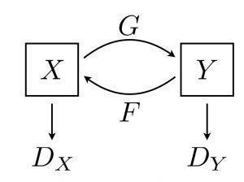
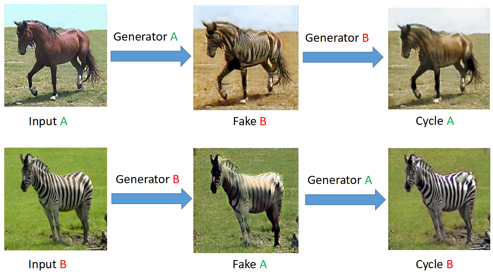

# CycleGan
- This is a Tensorflow implementation of CycleGAN, which is mainly based on the [project](https://github.com/hardikbansal/CycleGAN)
- [Original paper](https://arxiv.org/abs/1703.10593)
- [Original Project](https://github.com/junyanz/pytorch-CycleGAN-and-pix2pix)

## Blog
- I recommend you (if needed) to read this [Blog](https://hardikbansal.github.io/CycleGANBlog/) for understanding the model's construction.
- For me, this [Blog](https://www.microsoft.com/developerblog/2017/06/12/learning-image-image-translation-cyclegans/) by Microsoft Developer is also very beneficial to me. 

## Environment

- Tensorflow-gpu==1.4.0
- Python 3.6.0

## Downloading Training Data

- Click this [link](https://pan.baidu.com/s/1GkMjbZiYDaZb1dWcoxTSJA) for downloading the horse2zebra data.

## Model 

- Consist of 4 neural networks, including 2 Generators and 2 Discriminators.

## Results

- I just ran the model for 75 epochs (1000 images for each epoch) and got the following transferring pictures.

I am a little bit confused for this result. It seems the Generator B is bad to some degree.

## Waiting for your constructive suggestions

- Since I am a beginner in the field of Deep learning, I really need your help and advice. If you have found any incorrect spot in the code, please feel free to contact me. 